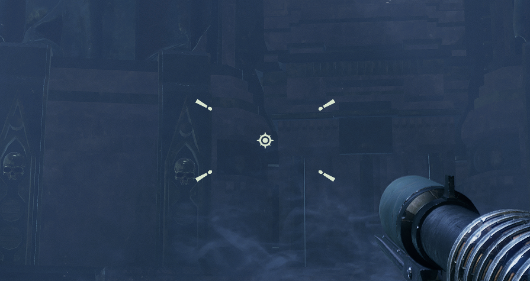

# Making Crosshairs

## Learn It the Hard Way

Read the [in-game crosshair files](https://github.com/Aussiemon/Darktide-Source-Code/tree/master/scripts/ui/hud/elements/crosshair/templates) and [those come with this mod](../custom_crosshairs/), you will eventually figure it out.

## The Not-so-hard Way

Read [whacky.lua](whacky.lua), a sample crosshair file with comments.

The finished crosshair will look like this, because playing the objective is important!



### Some Info

The crosshair is defined in function `template.create_widget_defintion`. It will be updated in function `template.update_function`, based on the current spread.

```lua
{
    value = "path/to/ingame/texture",
    style_id = "some_unique_name",
    pass_type = "rotated_texture", -- "texture" when no need to rotate
    style = {
        vertical_alignment = "center", -- or: "top", "bottom"
        horizontal_alignment = "center", -- or: "left", "right"
        offset = {
            aaa, -- Horizontal, right is positive.
            bbb, -- Vertical, down is positive.
            0
        },
        size = {
            ccc, -- Horizontal.
            ddd -- Vertical.
        },
        pivot = {
            eee, -- Horizontal.
            fff -- Vertical.
        },
        angle = ggg, -- Counter-clockwise is positive, in radian. Use `math.pi` if you need.
        color = {
            hhh, -- Alpha, 0-255.
            iii, -- Red, 0-255.
            jjj, -- Green, 0-255.
            kkk -- Blue, 0-255.
        }
    }
}
```
